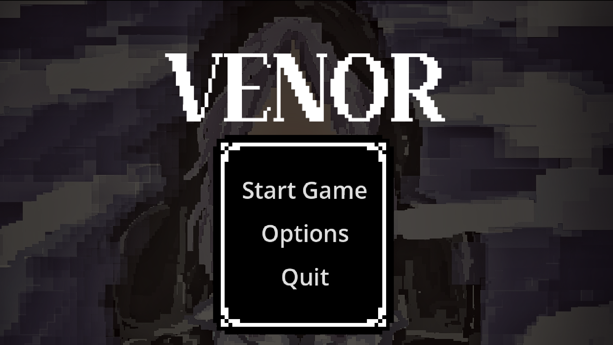
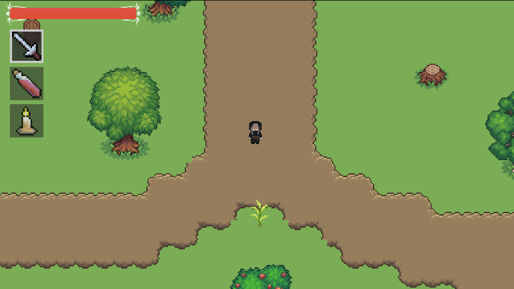
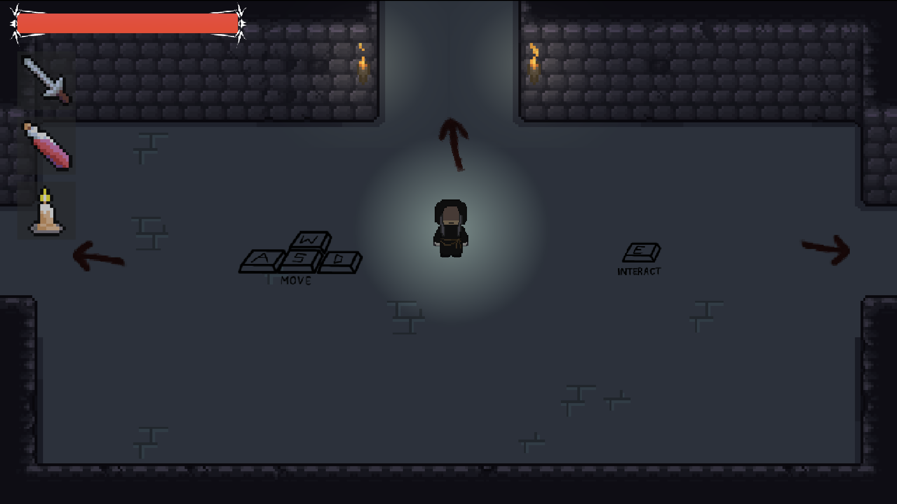

# VENOR
Play as a priest who delves into a dungeon in order to find their sibling; and possibly achieve enlightenment. Made for the 2026 Campfire Kyusi Game Jam, continued by Akio and Jazz/Fyris for Macondo. 

[GAME IS STILL A PROTOTYPE; MANY CHANGES AND POLISHES ARE NEEDED - IT'S GOT A LONG WAY TO GO!]

### Why did we make this project?
This project is very dear to us; as it's one of the first ever games we have developed together as a group of friends. We didn't fully get the chance to properly finish it during the Campfire Jam, and so we decided to have it continued in Macondo (and soon, other YSWS as it's still not complete!)

### How can you play the game?
1. Visit the game's itch page: https://akioo1997.itch.io/venor; no need to install anything on your local computer.
2. Feel free to take around 5 minutes of your time to just check it out; again, it's still very unfinished, but we'd appreciate if you give it a crack anyway!

### Controls
<table>
  <tr>
    <th>KEYBINDS</th>
    <th>ACTIONS</th>
  </tr>
  <tr>
    <td>WASD</td>
    <td>Move</td>
  </tr>
  <tr>
    <td>E</td>
    <td>Interact</td>
  </tr>
  <tr>
    <td>Left Mouse Button</td>
    <td>Use Item/Attack</td>
  </tr>
  <tr>
    <td>1, 2, 3</td>
    <td>Select Inventory Slot</td>
  </tr>
</table>

### Updates
**August 22, 2026: Prototype**
- A very VERY unpolished version of Venor was shipped to Macondo. It does have *some* of our intended features, but they are nowhere near the quality we hoped to achieve with this project. That being said, it's still playable, as it includes:
  - Main Menu (Carried over from Campfire)
  - Basic Exposition
  - Very Minimalistic Overworld
  - Base Dungeon
  - Base Enemies (who aren't polished)
  - A Subpar Boss with a small ending

All in all, it's not as high quality as we would like for it to be yet, but we'll strive to work more towards it in the future. more updates to be posted here!

### Acknowledgements/Credits
- RaphlTicket for the lore, main menu art, and overall idea of the game 
- alliumC for being one of the coders and the GOAT in godot 
- Akiostentar for being one of the other coders and for producing the music for the game 
- And IgniFyris for helping me continue this project!

### Screenshots

